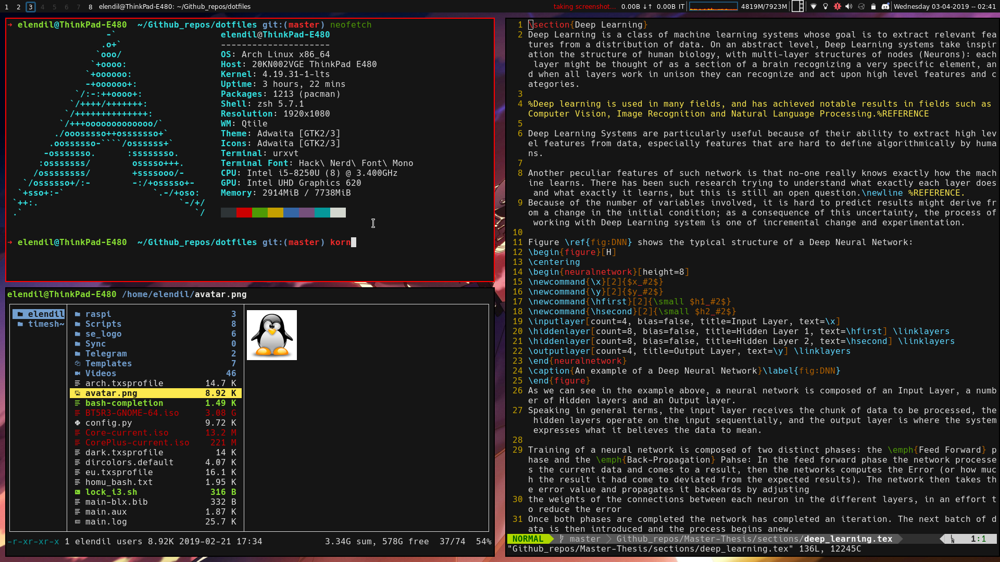

# My Dotfiles

## Setup
    Display Manager: LightDM
    Screen Locker: Light-locker
    Window Manager: Qtile (with optional xfce4 as fallback)
    Bar: QTile built-in bar
    Layouts: Master and stack, full screen, tree view
    Teminal: URXVT
    Shell: Zshell (with oh-my-zsh)
    File Manager: Ranger (with PCManFM as a graphical fallback)
    Browser: Firefox
    Music Player: Cmus
    Editor: Vim
    Program Launcher: Dmenu
    Document Viewer: Zathura and Master PDF Editor 5 (for editing documents)
    Font: Hack (Patched with Nerd Fonts)

In this repo you will find my dotfles for various programs, but mainly Qtile vim, zsh and Ranger.

*The install script tends to be buggy, so i suggest you deploy manually instead. The installer source code will provide all the information you need*

Running the installer will deplay my configs with the programs i like, so i suggest you take a look at the contents before running it. Also`install.sh` script only works on Arch. I am working on porting this to other distros and make this more flexible. Given a bank Arch install, the installer shuld get you to a functional desktop with all the programs you might need for day-to-day use.

**For a list of the Keybinds used with my QTile setup, see [here](resources/QTile_keys.md)**
